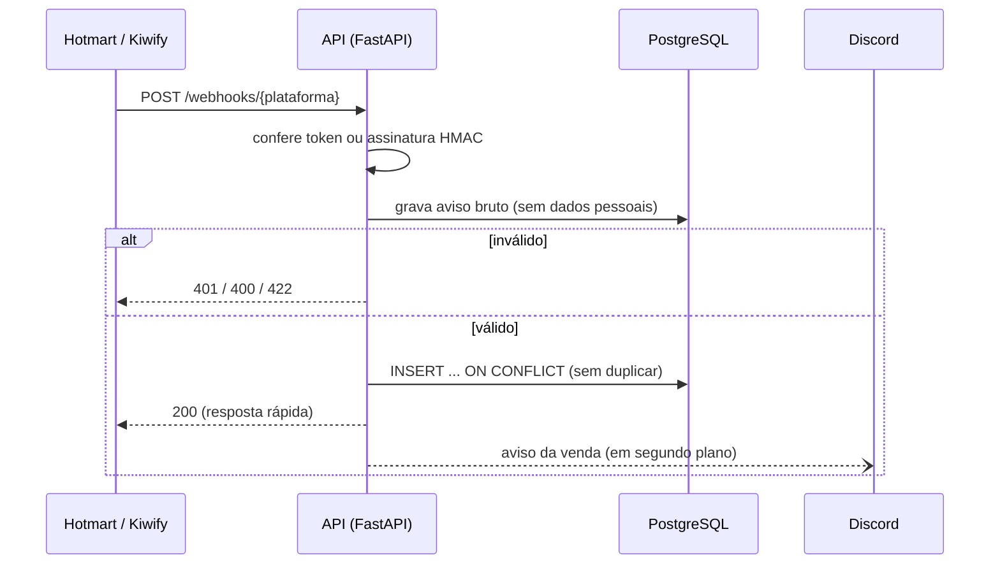

# webhook-vendas

[](https://github.com/MateusGitBoss/webhook-vendas/actions/workflows/ci.yml)

API que recebe os avisos automáticos de venda (webhooks) da Hotmart e da Kiwify, confere se são verdadeiros, grava cada venda uma única vez e avisa a equipe no Discord.

**Explicação para quem não é da área:** toda vez que alguém compra um curso, a plataforma de pagamento manda um aviso automático para o nosso sistema. Este projeto recebe esse aviso, confere que ele veio mesmo da plataforma (e não de alguém tentando liberar um curso de graça), registra a venda uma vez só, mesmo que o aviso chegue repetido, e manda uma mensagem no Discord da equipe. Se o cliente pedir reembolso, a venda é atualizada e a equipe também é avisada.

## Fluxo



## O que trata

| Situação | Resultado |
|---|---|
| Venda nova | Grava e avisa no Discord |
| Mesmo aviso repetido (a plataforma reenvia quando não recebe resposta) | 200, nada muda, sem aviso duplicado |
| Reembolso, cancelamento ou chargeback | Atualiza o status e avisa |
| Aprovação chegando **depois** do reembolso | Ignorada: status final não volta atrás |
| Token/assinatura inválidos | 401, aviso gravado para auditoria |
| JSON quebrado / campo faltando | 400 / 422 com o motivo |
| Evento que não é de compra (ex.: primeiro acesso ao curso) | 200 e ignorado, para a plataforma não reenviar |

## Autenticação de cada plataforma

| Plataforma | Como prova que o aviso é verdadeiro |
|---|---|
| Hotmart | Envia o *hottok* da conta no cabeçalho `X-HOTMART-HOTTOK` |
| Kiwify | Envia `?signature=` com o HMAC-SHA1 do corpo usando o token da conta. O token nunca trafega |

As duas comparações usam `hmac.compare_digest` (tempo constante). Os payloads seguem de forma simplificada as documentações públicas das plataformas; os exemplos estão em [`tests/fixtures`](tests/fixtures).

## Rotas

| Rota | Acesso | Para quê |
|---|---|---|
| `POST /webhooks/hotmart` | hottok | Avisos da Hotmart |
| `POST /webhooks/kiwify` | assinatura | Avisos da Kiwify |
| `GET /vendas/resumo?dia=` | público | Totais do dia (só agregados), usado pelo painel |
| `GET /vendas` | `Bearer API_TOKEN` | Últimas vendas |
| `POST /vendas/consulta-status` | `Bearer API_TOKEN` | Compras de um e-mail, usado pelo bot do Discord |
| `GET /saude` | público | Se a API alcança o banco |

Documentação interativa em `/docs`.

## Dados pessoais (LGPD)

- O e-mail do comprador é gravado só como HMAC-SHA256 com uma chave secreta (`HASH_SEGREDO`). Dá para buscar as compras de alguém sem guardar o e-mail.
- O aviso bruto guardado para auditoria tem nome, documento e telefone trocados por `***` e o e-mail por hash.
- A consulta por e-mail é `POST` com o e-mail no corpo: URL costuma ir parar em log.

## Como rodar

```bash
git clone https://github.com/MateusGitBoss/webhook-vendas && cd webhook-vendas
cp .env.example .env
docker compose up -d banco
uv sync
uv run alembic upgrade head
uv run uvicorn vendas.api:app --reload

# em outro terminal: 30 vendas simuladas, com repetições e reembolsos
uv run python scripts/simular_vendas.py --quantidade 30
```

Tudo em Docker: `docker compose up --build`.

### Testes e qualidade

```bash
uv run pytest      # cada teste recria o banco aplicando as migrações do Alembic
uv run ruff check . && uv run mypy
uv run alembic check   # garante que a migração bate com os modelos
```

## Deploy no Railway

1. *New Project → Deploy from GitHub repo* e escolha este repositório (o `railway.json` já configura Dockerfile e healthcheck).
2. Adicione um PostgreSQL no mesmo projeto e defina `DATABASE_URL` trocando `postgresql://` por `postgresql+psycopg://`.
3. Cadastre `HOTMART_HOTTOK`, `KIWIFY_TOKEN`, `HASH_SEGREDO`, `API_TOKEN`, `DISCORD_WEBHOOK_URL` e `CORS_ORIGENS`.
4. As migrações rodam sozinhas a cada deploy (`scripts/iniciar.sh`).

## Decisões técnicas

- **Adaptador por plataforma.** O resto do código só conhece `VendaNormalizada`; integrar a Eduzz seria um arquivo novo e uma linha no registro.
- **Unicidade garantida pelo banco**, não por um `SELECT` antes do `INSERT`: dois avisos iguais ao mesmo tempo passariam juntos pelo `SELECT`.
- **Grava o aviso antes de decidir.** Se algo der errado no processamento, o aviso original está lá para reprocessar.
- **Responde rápido e avisa depois.** As plataformas têm timeout curto e reenviam quando não recebem resposta.
- **SQLAlchemy + Alembic** aqui e SQL puro no [coletor-diario](https://github.com/MateusGitBoss/coletor-diario): escolhi comparar as duas abordagens.

## Limitações conhecidas

- O aviso no Discord roda no mesmo processo: se a API reiniciar logo depois de responder, ele se perde. Em produção usaria uma fila (Redis/RQ, por exemplo).
- Sem reprocessamento automático dos avisos gravados com erro (dá para fazer a partir de `eventos_webhook`).

## Como este projeto foi construído

Construído com o Claude Code como ferramenta de desenvolvimento, com cada mudança entrando por pull request revisado. O roteiro de estudo está em [`docs/ENTREVISTA.md`](docs/ENTREVISTA.md).

## Licença

MIT
